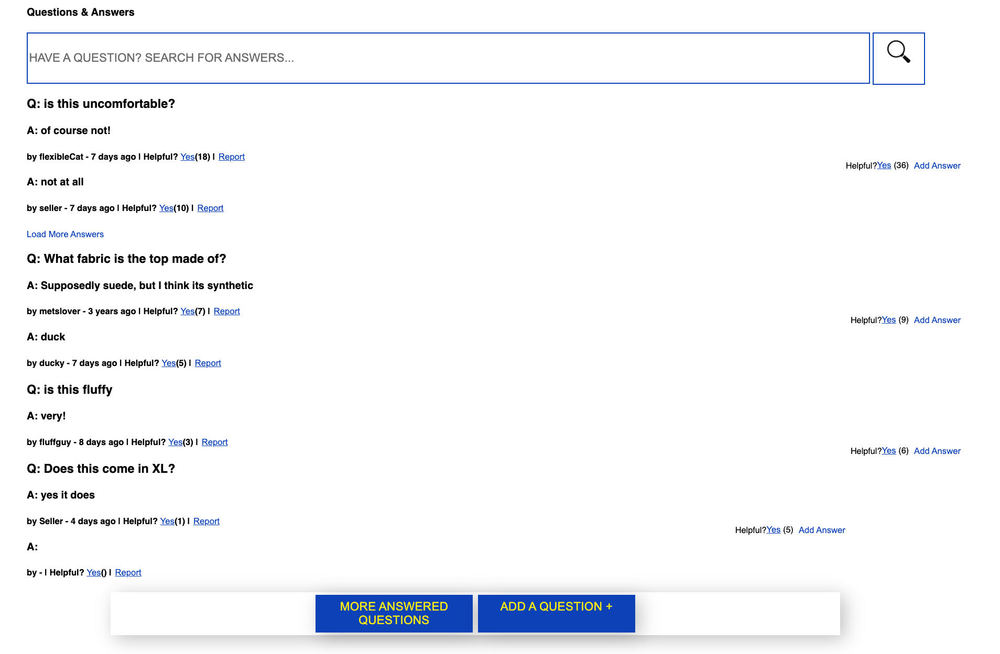
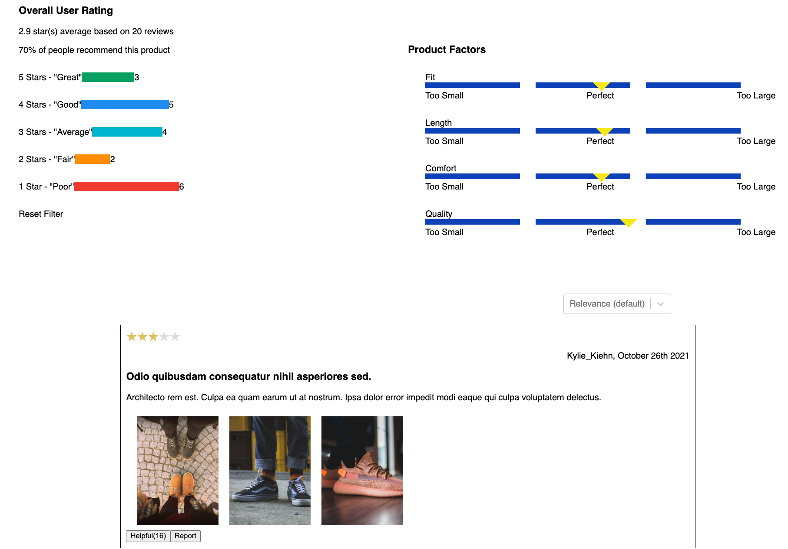

<div align="center">

# BestestBuy
## A better store than the other one. I'd buy here
[Description](#Description) |
[Installation](#Installation) |
[Usage](#Usage) |
[Tech-Stack](#Tech-Stack)

</div>


## Description:


The app emulates an e-commerce site with 4 sub-components:

### Overview:


- Image Gallery with epand view mode, arrow buttons, responsive thumbnails.
- Cart icon will open a pop-up window to display all the products has been added.
- Star rating component and link to review section.
- Product category, name, overview and features.
- Product price with discount display feature if current product is on sale.
- Style selector allow user to select between different style, and always will have a style been selected.
- Size selector allow user to select between different size.
- Quantity selector allow user to select a quantity up to 15, defualt to 1 once size has been selected.
- Add to bag button will be used to place the style, size and quantity of the product selected into the user’s cart. If size hasn't been selected, dropdown will open and a message will appear above the dropdown stating "Please select size".
- Share icons provide user a method to share current product to social media.

### Related Product


-

### Questions and Answers:


-

### Ratings and Reviews:

 
- Overall User Rating Section
  - Dynamically calculates average user rating to one decimal place
  - Dynamically calculates percentage of users who recommend the product
  - Shows number of users who gave a particular rating
  - Clicking on a star value filters out the reviews shown in the reviews section
  - Reset filter removes all filters
 
 - Product Factors section
   - Moves yellow indicator to display the average thoughts about a particular product factor
 
 - Sort dropdown
   - Sorts the review tiles by relevance, newest, or helpful
 
 - Review Tile
   - Shows all reviews for a particular product ID with images, review title, review body, reviewer name, starts, and date
   - Clicking on image opens up a modal view
   - clicking helpful marks an item as helpful and sends a post request
   - clicking report displays "thanks for reporting" and removes tile after a 1 sec and sends a request
   - Clicking more reviews will display 2 more reviews if available
   - Reviews list will prerender at least 2 review tiles to avoid needing to make API calls so user doesn't have to wait
   - Review tiles will work with cacheing so avoid unnecessary calls to the API
   - More reviews button will disappear if no more reviews are present


## Installation

### Step1: Clone the repo to your local computer

```shell
# clone
git clone https://github.com/RFCTeamSaturn/BestestBuy.git
```

### Step2: Set up config.js

#### create a config.js in root folder
```js
module.exports = {
  API_KEY: 'YOUR TOKEN',
}
```

#### create a config.js in client/src folder

```js
export const API_KEY = '';
export const headers = {
  headers: {
    Authorization: API_KEY,
  },
};
export const url = '';
```

### Step3: Install dependencies

- In root folder, install all server side dependencies.
```shell
npm install
```
- In client folder, install all client side dependencies.
```shell
npm install
```

## Usage

-  In client folder, build wepack transpiling react
```shell
npm run build
```
- In root folder, open localhost server
```shell
npm run start
```

## Tech-Stack:

### Frontend
- ReactJS
- Sass

### Backend
- Webpack
- Express server

### Testing
- Jest

### Dependencies
- Axios
- ESLint
- Sass
- Jest
- dotenv
- fortawesome
- js-cookie
- moment
- react-image-magnifiers
- react-lazyload
- react-router-dom
- react-select
- react-share
- sweetalert
- regenerator-runtime
